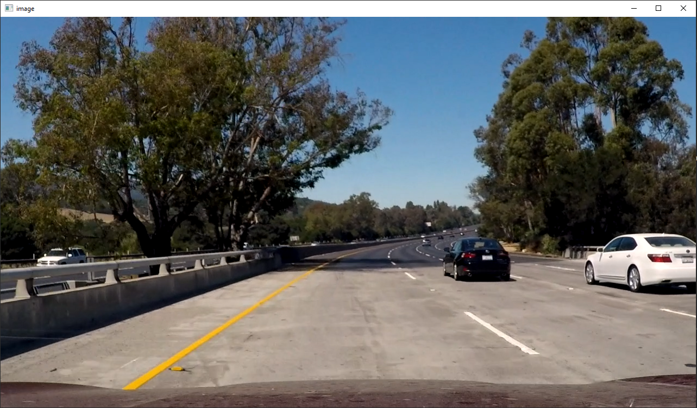
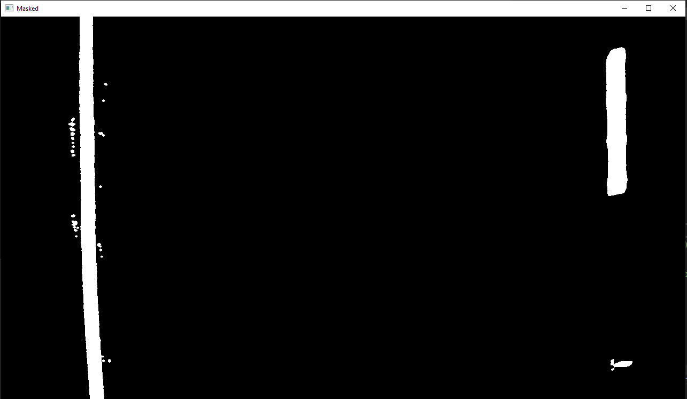

# Lane-Detection
# 1. Camera Calibration

Radial distortion causes straight lines to appear curved. Radial distortion becomes larger the farther points are from the center of the image.To remove this effect, We need to use camera calibration. You can see the difference between the 2 pictures.

# 2.Perspective Transform
  
We can change the perspective of a given image or video for getting better insights into the required information. In Perspective Transformation, we need to provide the points on the image from which want to gather information by changing the perspective. After that:
 

 
# 3. Masking

 We need to find lanes so We should to separate lanes from road. After using masking, result be like:
   

   
# 4. Finding Lanes

 The next step is to use a sliding window technique. Each time we search within a sliding window, we add potential lane line pixels to a list. If we have enough lane line pixels in a window, the mean position of these pixels becomes the center of the next sliding window.
  

# 5. Final

 After filled in the Lane Line, Now that we’ve identified the lane lines, we need to overlay that information on the original image. 
    

